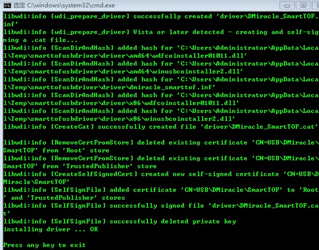
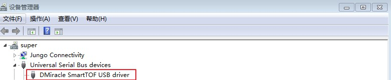
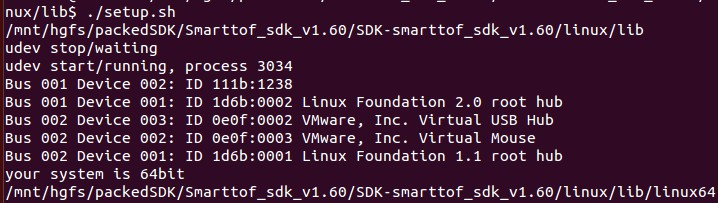

Module connection
=================

Module connection under windows
+++++++++++++++++++++++++++++++

When connecting and using the module under Windows, you need to install the module's USB driver. The general installation process of the module is as follows：

Module preparation
--------------------

Module kit includes TC/TS series module, USB cable and power supply (some models do not require power supply) as shown in Table 2, take TC series module as an example:

.. list-table:: Table2 Module kit
	:widths: 30 40 60
	:header-rows: 0
	:stub-columns: 0
	
	* - 1
	  - TC series module
	  - .. image:: imageG/win_G1.jpg
			:width: 100
	* - 2
	  - Micro USB cable
	  - .. image:: imageG/win_G2.jpg
			:width: 100
	* - 3
	  - 12V power adapter
	  - .. image:: imageG/win_G3.jpg
			:width: 100
			
Module installation
--------------------

In the Windows system, run the **smarttof_usb_install.exe** program in the *windows / drivers* directory of the SDK to install the driver. The normal installation process is shown in the following figure.

After the driver is installed normally, connect the USB cable to the module and PC, and open the device manager to see the device name of the module, as shown in the figure below.

Module connection under linux
+++++++++++++++++++++++++++++

libusb installation
-----------------------

If you using linux release version ubuntu14 and ubuntu16, libusb was installed by default.If you need install libusb, remove libusb installed, and type the following command ::

  sudo apt-get install libusb-1.0-0-dev

Then run the smartTOFViewer tool in the tool / SmartTofViewer directory under the SDK directory to check whether the device is connected properly. The normal connection displays the device number as shown in the figure below.

.. image:: imageG/win_G6.jpg

Change libusb permissions
-------------------------

Add a new usb rule for module to avoid input password every time open module, run *setup.sh* scripts in "linux/lib" folder, result like follows:

