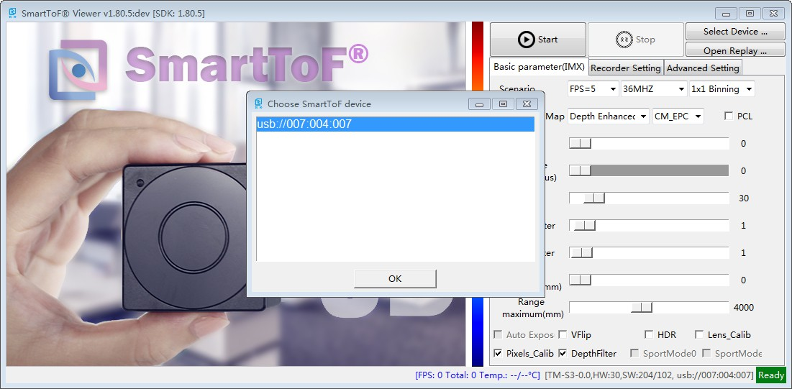
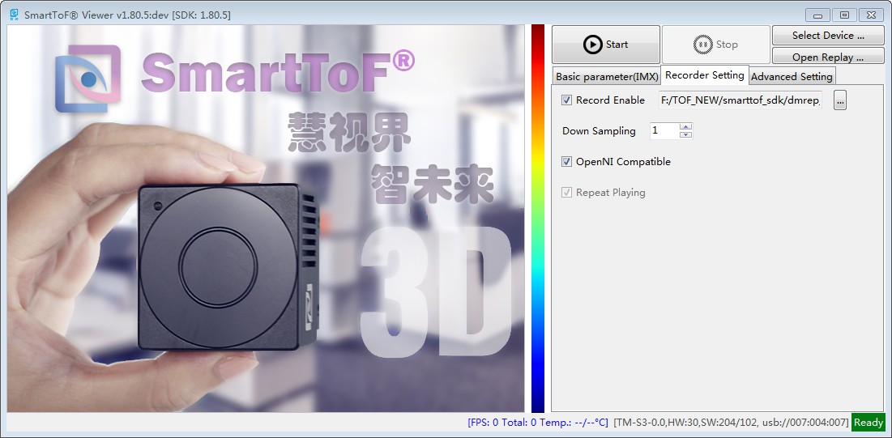
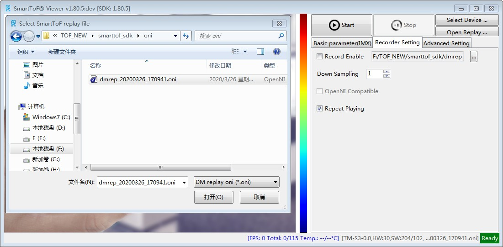
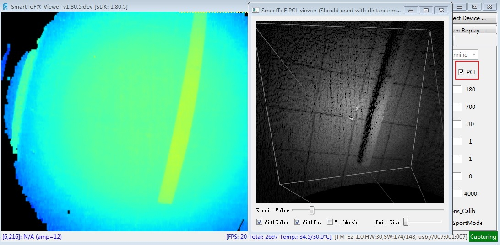

Preliminary use of tools
=========================

The SDK provides the **SmartToFViewer** display evaluation tool and the **dmcam-cli** command line tool, which are respectively located in the **tools** directory in the SDK.
**SmartToFViewer** also provides **smartTOF_PCLViewer** pointcloud display tool.

SmartToFViewer usage
+++++++++++++++++++++

SmartToFViewer can be directly used to evaluate the image of the measured object, and set the module related parameters through the UI.
View the module's related information and working status, SmartToFViewer can be used when the module usb is installed normally.

SmartToFViewer interface introduction
-------------------------------------

The overall preview after SmartToFViewer is opened is as follows. SmartToFViewer mainly includes an image display area,
Basic parameter area, advanced parameter area, filter setting area, information area, and opening and closing of the module:

.. image:: imageG/win_V1.png

SmartToFViewer acquisition display
----------------------------------

Double-click to run the SmartToFViewer tool, click to select the device. If multiple modules are connected at the same time, the device list will be listed.
Left click to select the device you want to use and click the OK button in the picture, as shown below：

After selecting the device, click the ``Start`` button to capture the image for display. The default view model is depth map-color coding, as shown in the figure below,
which shows the depth and distance information of the object.
Drag or click the relevant button on the interface to enable the acquisition parameter setting and filtering function of the module. 
For details, please refer to the detailed description of SmartToFViewer in the detailed description.

.. _doc-Replay:

SmartToFViewer video function
------------------------------
SmartToFViewer support recording function，recorded video files can be used as image data for offline algorithm evaluation.
After the Viewer is opened, select the device, click the ``Recorder setting`` tab in the figure, and check the ``Recording Enable`` 
to select the storage location of the recording file, as shown below:

.. caution::

  There is also an ``OpenNI compatible`` option under the ``Recording Settings`` tab. The function description of this option is as follows:

  - In the enabled mode, if **NiViewer** is used to play the video file, the depth map and grayscale map are output
  
  - In the disabled mode, when playing a video file with NiViewer, the original image of 4DCS (raw data of the tof chip) is output.

Click ``Stop`` on SmartToFViewer to stop recording and save the oni format video file to the location you just selected.

SmartToFViewer plays video files
--------------------------------

Open SmartToFViewer, click the `` Open Replay `` button, select the saved video file,
The USB device number in the lower corner becomes the file name of the video, as shown below:

If you want to turn on point clouds, enable the "PCL" checkbox on "SmartTofVeiw" as shown below:

dmcam-cli command line tool usage
+++++++++++++++++++++++++++++++++

The dmcam-cli tool in the SDK is convenient for users to diagnose and test during secondary development. It mainly includes the following functions：

* Obtaining device information
* Hardware parameter setting
* Data acquisition and storage
* Firmware update

dmcam-cli basic information acquisition
---------------------------------------

**dmcam-cli** usually interacts with devices through command line parameter mode, script file mode, and interactive mode. The following figure shows the command line parameter mode and interactive mode to obtain device information.：

.. image:: imageG/win_V9.jpg

Please refer to **dmcam-cli** for other specific functions :ref:`sec-reference` 

