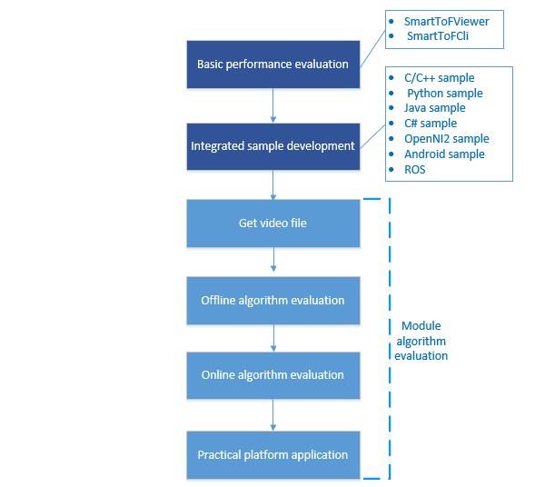
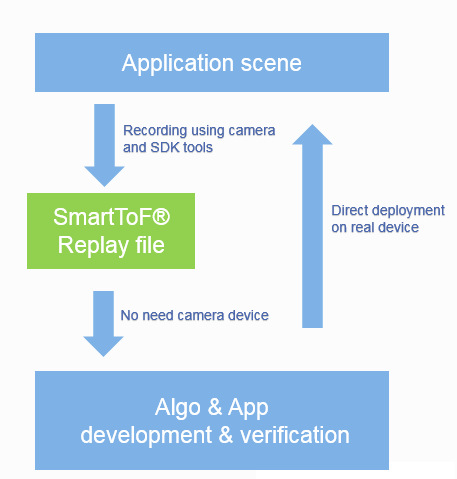

.. _doc-GRIP:

Basic development process
=========================

Development process diagram
+++++++++++++++++++++++++++

In the secondary development of Smartof modules, the general development flowchart is as follows:

Development process description
+++++++++++++++++++++++++++++++

Module basic performance evaluation
-----------------------------------

After obtaining the SmartToF module, use the SmartToFViewer tool provided in the tools directory of the SDK to display the measured object in real time. According to the distance and movement of the measured object during display, adjust related parameters on SmartToFViewer, and evaluate the imaging quality and depth distance accuracy of the module through the display effect evaluation module.
If you want to evaluate the point cloud effect of the module, you need to enable SmartToF_PCLViewer at the same time you enable SmartToFViewer.

Module sample integrated development
------------------------------------

After using *SmartToFViewer*， you will know some parameters and filters influence on module's image display，you can follow instruduction in :ref:`sec-tutorial` ,read and run examples provided by SDK, 
Master the main steps of using the SDK under the development platform and language environment you want to use, refer to the sample code, and the relevant API in the code is detailed
in chapter :ref:`doc-Api` , write and integrate your own test samples to collect and display module data.

* Users using C/C++ refer to samples in :ref:`C/C++<tutorialc>` .
* Users using Python refer to samples in :ref:`Python<tutorialpython>` .
* Users using Java refer to samples in :ref:`Java<tutorialjava>` .
* Users using  C# refer to samples in :ref:`C#<tutorialcsharp>` .

Module algorithm evaluation development
---------------------------------------

In order to use smarttof module for algorithm development conveniently and quickly, SmartToF SDK provides a complete set of development process descriptions，
Dividing the entire development process into :
 
  + Get video file
  + Offline algorithm evaluation
  + Online algorithm evaluation
  + Practical platform application
 
The detailed description is as follows:

Get Video file
^^^^^^^^^^^^^^^^

The basis of the algorithm evaluation is based on complete and accurate data. In the case that there is no module in the previous period for data collection or if the collected image data is not correct,
It can be obtained through the **smarttofviewer's** recording function in advance, or through the **rx command** of the **dmcam-cli** tool, or directly from the digital trace company FAE, and then downloaded through the Data Miracle company website (the download address will be announced later). How to use Smarttofviewer's video function to record video files
reference *tools instruduction* in :ref:`doc-Replay` , using **dmcam-cli** tools's "rx" command save video please run ``help rx`` command to get help.

Offline algorithm evaluation
^^^^^^^^^^^^^^^^^^^^^^^^^^^^

After obtaining the video file, open the video file by calling the interface ``dmcam_dev_open_by_uri`` and then Then load and run the evaluation algorithm on the obtained video file.
Compare the actual effect of the algorithm after it is added. If you want to filter the original depth data, you can add commonly used median or bilateral filtering, or you can use improved depth filtering, and evaluate the effect of the algorithm by the image effects before and after filtering.
This offline algorithm evaluation solves some users' normal work of algorithm evaluation and development when there is no module or the module data cannot be collected normally.

Online algorithm evaluation
^^^^^^^^^^^^^^^^^^^^^^^^^^^

When performing online algorithm evaluation, you need to open the actual SmartToF device. The API for opening the device is no longer the same as the API for opening the recording file, using ``dmcam_dev_open`` interface.
After the previous algorithm evaluation of the offline video file, the effect of the evaluation algorithm is basically determined, and it is determined whether the evaluation algorithm meets the design requirements. 
This is followed by a dynamic actual algorithm evaluation on the module. While adding the offline evaluation algorithm processing, collect real-time data of the SmartToF module, and observe and evaluate the actual effect 
of the algorithm on the PC in real time. Finally, determine whether the algorithm used on SmartToF meets the requirements.

.. Tip::

	The main difference between the offline algorithm evaluation and the online algorithm evaluation is that the opened devices are different. The offline algorithm evaluation opens the device simulated by the video file, and the online algorithm evaluation opens the real module device.
	The calling API when opening the device is also different. The interface called when the offline algorithm opens the recording file is ``dmcam_dev_open_by_uri`` , Online algorithm develop opened a real device using ``dmcam_dev_open`` interface。

Practical platform application
^^^^^^^^^^^^^^^^^^^^^^^^^^^^^^

Previous offline algorithm evaluation and online algorithm evaluation were mainly based on the PC platform. In practical applications, SmartToF modules may need to run on various embedded platforms.
At this time, it is necessary to run the corresponding SmartToF library on the corresponding platform, at the same time, transplant the previous evaluation algorithm to the corresponding platform, 
and optimize the algorithm according to the platform. Finally, application development is performed on the actual embedded platform.