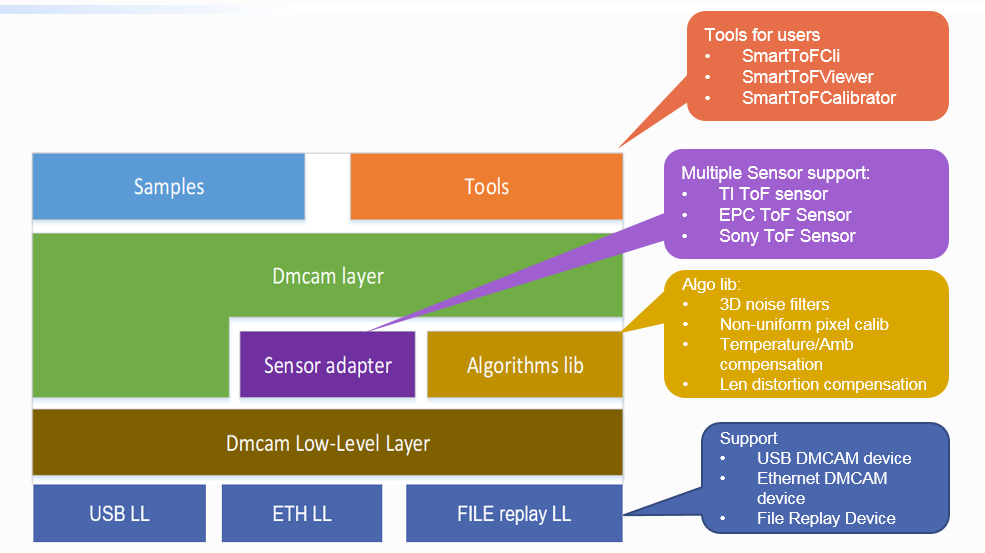
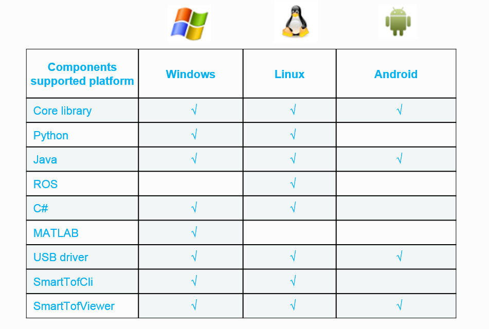
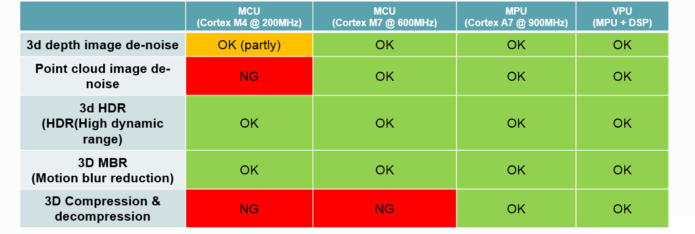
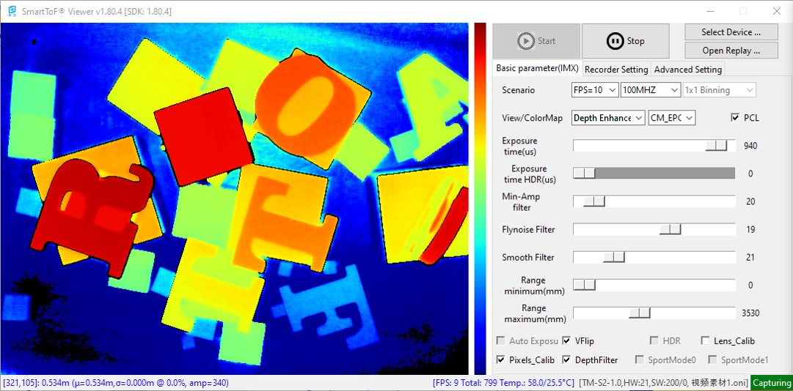
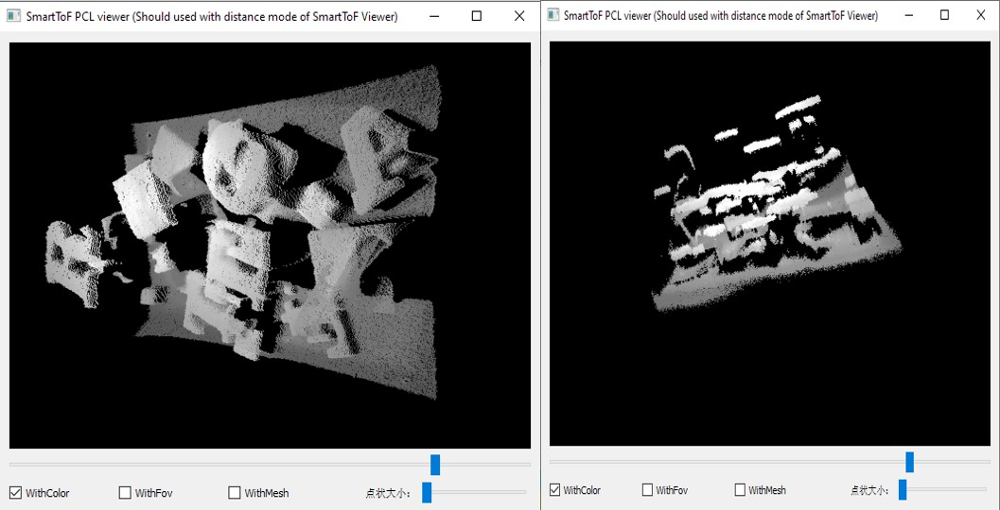
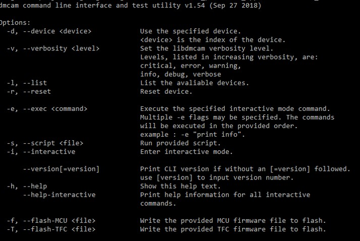

SDK Overview
==================

Welcome to the SDK document of the SmartToF module. Through this document, you can :
 
 - Know SDK Components
 - Use SmartToF series modules
 - Use the tools in the SDK
 - Secondary develop based on SmartToF module

SmartToF series module introduction
+++++++++++++++++++++++++++++++++++

SmartToF TC(QQVGA) and TS(QVGA) series modules are developed by Data Miracle which using industry-leading sensor chip, with high measurement accuracy,
Strong anti-interference ability, compact appearance and other advantages. The module can be used in emerging technologies such as accurate people flow statistics, 
logistics storage, gesture recognition, robot obstacle avoidance, and vehicle control.

SDK supported modules table:

+---------------------------+------------+----------+----------+----------+
| **Contents**              | **TC-E2**  | **TC-E3**| **TC-E4**| **TS-S3**|
+---------------------------+------------+----------+----------+----------+
| Hardware version          | 30         | 30       | 30       |  30      |
+---------------------------+------------+----------+----------+----------+
| Software version          |  >=172     |  >=172   | >=168    |  >=206   |
+---------------------------+------------+----------+----------+----------+
| Agent&Bootloader version  |  >=148     |  >=148   | >=148    |  >=101   |
+---------------------------+------------+----------+----------+----------+

SmarToF SDK Introduction
++++++++++++++++++++++++

SmartToF SDK is a software toolkit developed with SmartToF series modules，supports platforms such as windows、linux、Android and so on，SDK's components like follows：

Core Library Main Function Specification
++++++++++++++++++++++++++++++++++++++++

+--------------------------------------+------------------------------+------------------------------------------------------------------------------------------------------------------------------------------------------------------------------------------------------------------------------------------------------+
|                                      | Sensor register read/write   | Supported                                                                                                                                                                                                                                            |
|                                      +------------------------------+------------------------------------------------------------------------------------------------------------------------------------------------------------------------------------------------------------------------------------------------------+
|                                      | Depth mode                   | High precision mode (8xQuads, for TC-S series) Normal mode (4xQuads) Motion reduction mode (2xQuads)                                                                                                                                                 |
|                                      +------------------------------+------------------------------------------------------------------------------------------------------------------------------------------------------------------------------------------------------------------------------------------------------+
|                                      | Modulation frequency         | TC-S series: single frequency mode: 10~100MHz in 1MHz resolution dual frequency mode: any frequency pair between 10~100MHz TC-E series: Fixed frequency 12MHz, 24MHz, 36MHz                                                                          |
|                                      +------------------------------+------------------------------------------------------------------------------------------------------------------------------------------------------------------------------------------------------------------------------------------------------+
|                                      | Exposure time                | TC-S series : Single exposure time: 1~1000us in 1us resolution Dual exposure time(HDR): any exposure time beween 1~1000us TC-E series: Single exposure time: 1~1500us in 1us resolution Dual exposure time(HDR): any exposure time beween 1~1500us   |
|                                      +------------------------------+------------------------------------------------------------------------------------------------------------------------------------------------------------------------------------------------------------------------------------------------------+
|                                      | ROI                          | Supported                                                                                                                                                                                                                                            |
|                                      +------------------------------+------------------------------------------------------------------------------------------------------------------------------------------------------------------------------------------------------------------------------------------------------+
|                                      | Binning                      | TC-S series 1x1,2x2,4x4,8x8; TC-E series:1x1,2x2,2x4                                                                                                                                                                                                 |
| Sensor control & Depth calculation   +------------------------------+------------------------------------------------------------------------------------------------------------------------------------------------------------------------------------------------------------------------------------------------------+
|                                      |                              | Global linear compensation                                                                                                                                                                                                                           |
|                                      |                              +------------------------------------------------------------------------------------------------------------------------------------------------------------------------------------------------------------------------------------------------------+
|                                      |                              | non-uniform pixel compensation                                                                                                                                                                                                                       |
|                                      |                              +------------------------------------------------------------------------------------------------------------------------------------------------------------------------------------------------------------------------------------------------------+
|                                      |                              | Cyclical error compensation                                                                                                                                                                                                                          |
|                                      | compensation                 +------------------------------------------------------------------------------------------------------------------------------------------------------------------------------------------------------------------------------------------------------+
|                                      |                              | Frequency drift compensation                                                                                                                                                                                                                         |
|                                      |                              +------------------------------------------------------------------------------------------------------------------------------------------------------------------------------------------------------------------------------------------------------+
|                                      |                              | Temperature compensation                                                                                                                                                                                                                             |
|                                      |                              +------------------------------------------------------------------------------------------------------------------------------------------------------------------------------------------------------------------------------------------------------+
|                                      |                              | Lens calibration                                                                                                                                                                                                                                     |
|                                      |                              +------------------------------------------------------------------------------------------------------------------------------------------------------------------------------------------------------------------------------------------------------+
|                                      |                              | Ambient light compensation                                                                                                                                                                                                                           |
+--------------------------------------+------------------------------+------------------------------------------------------------------------------------------------------------------------------------------------------------------------------------------------------------------------------------------------------+
|                                      |                              | Fly noise filter                                                                                                                                                                                                                                     |
|                                      +                              +------------------------------------------------------------------------------------------------------------------------------------------------------------------------------------------------------------------------------------------------------+
|                                      |                              | Fill hole filter                                                                                                                                                                                                                                     |
|                                      +                              +------------------------------------------------------------------------------------------------------------------------------------------------------------------------------------------------------------------------------------------------------+
|                                      | Spatial filters              | Fast bilateral filter                                                                                                                                                                                                                                |
|                                      +                              +------------------------------------------------------------------------------------------------------------------------------------------------------------------------------------------------------------------------------------------------------+
|                                      |                              | Fast median filter                                                                                                                                                                                                                                   |
|                                      +                              +------------------------------------------------------------------------------------------------------------------------------------------------------------------------------------------------------------------------------------------------------+
|                                      |                              | Confidence/Amplitude filter                                                                                                                                                                                                                          |
|                                      +------------------------------+------------------------------------------------------------------------------------------------------------------------------------------------------------------------------------------------------------------------------------------------------+
|                                      |                              | hysteresis noise filter                                                                                                                                                                                                                              |
| 3D image processing                  + Temporal filters             +------------------------------------------------------------------------------------------------------------------------------------------------------------------------------------------------------------------------------------------------------+
|                                      |                              | IIR low pass filter                                                                                                                                                                                                                                  |
|                                      +------------------------------+------------------------------------------------------------------------------------------------------------------------------------------------------------------------------------------------------------------------------------------------------+
|                                      |                              | 60+ color palette                                                                                                                                                                                                                                    |
|                                      +                              +------------------------------------------------------------------------------------------------------------------------------------------------------------------------------------------------------------------------------------------------------+
|                                      |                              | Depth image to RGB24/BGR24/RGBA32/BGRA32                                                                                                                                                                                                             |
|                                      + Pesudo-color convertion      +------------------------------------------------------------------------------------------------------------------------------------------------------------------------------------------------------------------------------------------------------+
|                                      |                              | IR image to RGB24/GRAY8                                                                                                                                                                                                                              |
|                                      +                              +------------------------------------------------------------------------------------------------------------------------------------------------------------------------------------------------------------------------------------------------------+
|                                      |                              | Histogram-equalization on depth and IR Pesudo-color image                                                                                                                                                                                            |
|                                      +------------------------------+------------------------------------------------------------------------------------------------------------------------------------------------------------------------------------------------------------------------------------------------------+
|                                      | Compression& decompression   | support lossless compression/decompression                                                                                                                                                                                                           |
|                                      +------------------------------+------------------------------------------------------------------------------------------------------------------------------------------------------------------------------------------------------------------------------------------------------+
|                                      | Point cloud                  | Support depth image to point colud convertion with each point in (x,y,z), (x,y,z,d), (x,y,z,IR)                                                                                                                                                      |
+--------------------------------------+------------------------------+------------------------------------------------------------------------------------------------------------------------------------------------------------------------------------------------------------------------------------------------------+
|                                      |                              | Support OpenNI compatible ONI file format.                                                                                                                                                                                                           |
|                                      +                              +------------------------------------------------------------------------------------------------------------------------------------------------------------------------------------------------------------------------------------------------------+
|                                      | Recoding                     | Support record all parameter setting during capturing                                                                                                                                                                                                |
| Recording & replaying                +                              +------------------------------------------------------------------------------------------------------------------------------------------------------------------------------------------------------------------------------------------------------+
|                                      |                              | Support embedded calibration data inside record file                                                                                                                                                                                                 |
|                                      +------------------------------+------------------------------------------------------------------------------------------------------------------------------------------------------------------------------------------------------------------------------------------------------+
|                                      | Replaying                    | Replay file is emulated as SmartTOF Virtual device. All image processing function can be changed on-the-fly using replay files                                                                                                                       |
+--------------------------------------+------------------------------+------------------------------------------------------------------------------------------------------------------------------------------------------------------------------------------------------------------------------------------------------+

Multiple platform & Multiple dev language 
+++++++++++++++++++++++++++++++++++++++++

- All language extensions have 100% C-API coverage
- All tools and samples are cross-platform

	
High performance
++++++++++++++++

- Key algorithms are optimized under PC, ARM and DSP platforms with SSE2, ARM-NEON and DSP instructions.
	

	  
SmarToFViewer Introduction
++++++++++++++++++++++++++
- Use case

  - Camera evaluation
  - Application scenario recording
- Main Function

  - Depth/IR/PCL image visualization
  - Recording and replay
  - Camera parameter adjusting
	
	- ROI&BINNING
	- HDR
	- FPS&Frequency
  - Image filter enable/disable
  - 3D pointcloud view

	  
Commandline tool Introduction
+++++++++++++++++++++++++++++
- Use case

	- Camera diagnostic、testing、benchmarking、calibration
	- Manufacturing auto testing
- Main Function

	- Device enumeration
	- Device firmware upgrade
	- Device parameter set/get
	- Low-level register read/write
	- Depth/IR/PCL image capturing and saving
- Working mode

	- Shell argument mode
	- Shell interactive mode
	- Scripts mode
	

	  
SDK document introduction
+++++++++++++++++++++++++

This SDK document description is continuously written, corrected, and modified by Digital Trace staff. The document consists of four main sections. The content of each part is allocated according to the actual situation. The content of each section is relatively intuitive.

* :ref:`sec-general` introduced overview of SmartToF module and SDK, list the SDK's related resources including SmartToF modules :ref:`doc-GRIP`
* :ref:`sec-start` provided methods on how to setup develop platform and usage of some tools.
* :ref:`sec-tutorial` shows usage of SDK samples in different platform, including some pictures, codes in sample is helpful for secondary development.
* :ref:`sec-reference` provided introduction of C API lib、python、Java、C#、ros and Android extension，if you want to get more detailed information during secondary development, please read this chapter carefully.

