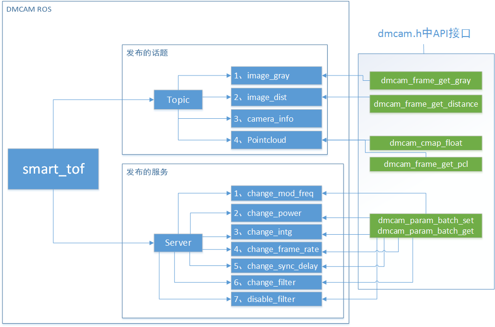

ROS extension design introduction
==================================

ROS extension Overview
+++++++++++++++++++++++

The ROS extension function provided in the SDK is a package of the Dmcam API on the basis of ROS. When we call the ROS API, we will interact with the module through the corresponding dmcam api.

ROS extension framework
+++++++++++++++++++++++

The correspondence between the API in ROS and the API in dmcam is as follows.

