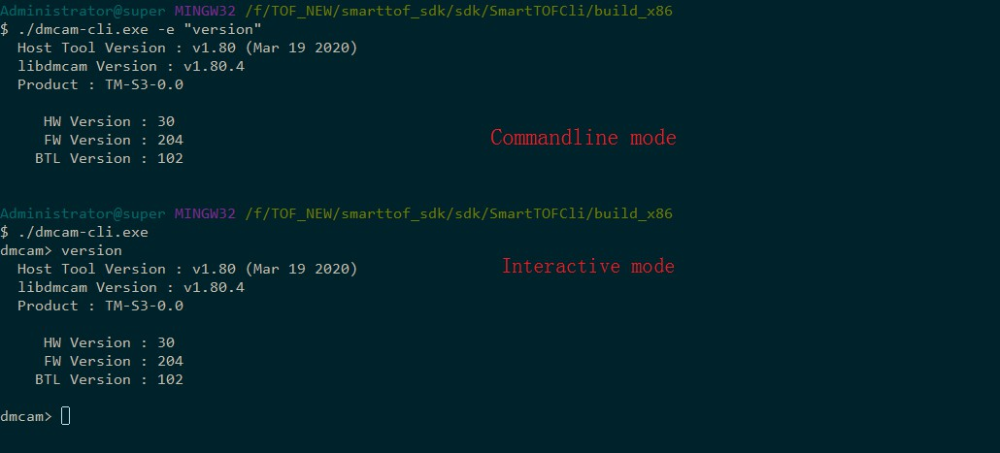
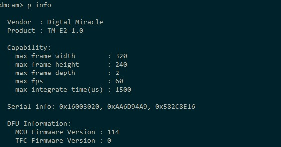
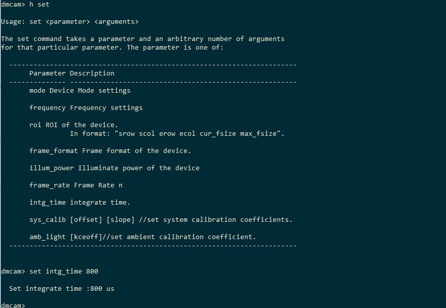
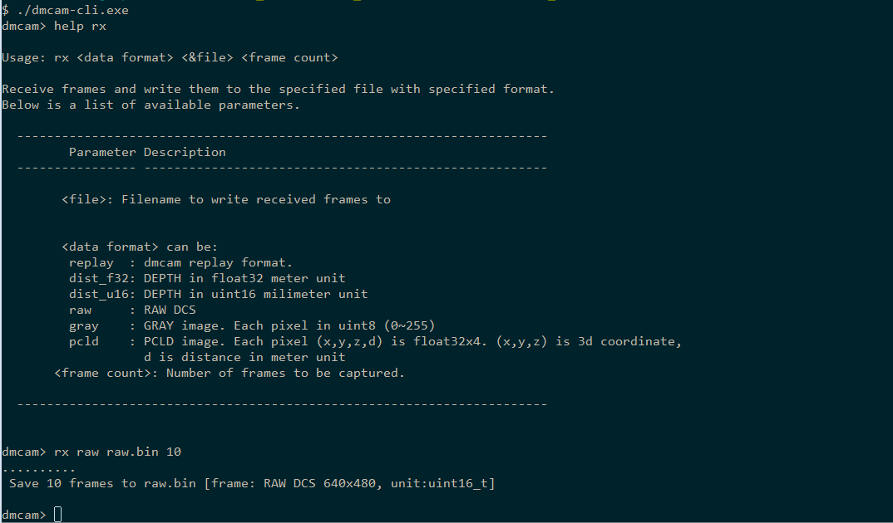
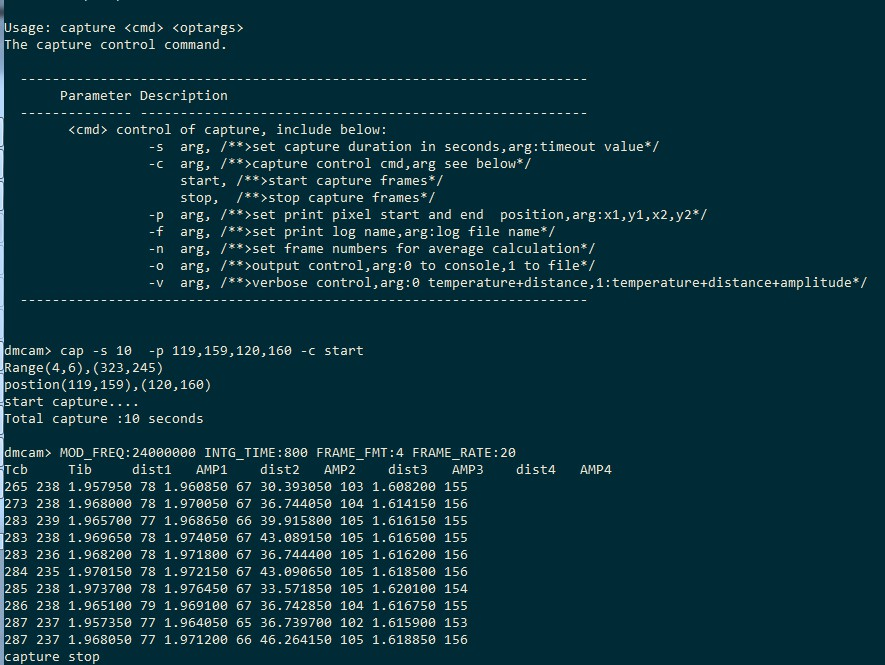
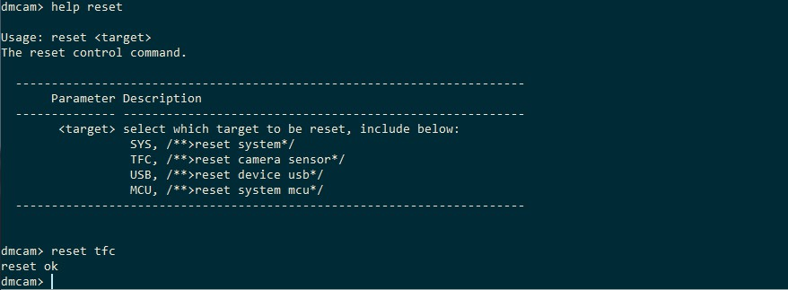

SmartToFCli instructions
++++++++++++++++++++++++

Overview
==================

The dmcam-cli tool in the SDK is convenient for users to diagnose and test during secondary development. The tool covers almost all the API support of the dmcam library. You can use the dmcam-cli tool to make batch scripts and design your own scenarios. Get the corresponding data.
Including the following functions：

* View a list of available devices
* Obtaining device information
* Destination register configuration
* Read and set common parameters
* Acquisition and storage of different types of image data
* Device reset
* Device firmware update

Operating mode
===================

dmcam-cli can interact with hardware devices through the command line. Generally, it is used in the following three ways：

* Command line parameter mode：See below for specific parameter definitions :ref:`doc-cmd`
* Script file mode: refer to ‘-s, --script <file>’ option in :ref:`doc-cmd`
* Interactive mode：refer to '-i, --interactive’ option in :ref:`doc-cmd`

The following figure is a reference screenshot of the command line parameter mode and interactive mode.

.. tip::
    Under windows, double-click to run dmcam-cli.exe directly, and enter interactive mode by default.
	
	
.. _doc-cmd:

Detailed command
====================

The following table lists all dmcam commands and parameters, and shows the basic usage of the sample. For more detailed instructions, you can enter **--help** and **--help-interactive** parameters to view.

.. list-table:: Command list
	:widths: 20 30 25 25
	:header-rows: 1
	
	* - Script mode functions
	  - options
	  - appended options
	  - example
	* - Designated device
	  - ``-d, --device <device>``
	  - 
	  - ``dmcam-cli.exe --print info --device 0``
	* - set verbosity
	  - ``-v, --verbosity <level>``
	  - 
	  - ``dmcam-cli.exe --print info --device 0 -v critical``
	* - Enumerating devices
	  - ``-l, --list``
	  - 
	  - ``dmcam-cli.exe -l``
	* - Reset device
	  - ``-r, --reset``
	  - 
	  - ``dmcam-cli.exe -r``
	* - Interactive mode command, supports multiple executions.
	  - ``-e, --exec <command>``
	  - 
	  - ``dmcam-cli.exe -e "print info" -e "print frame_format"``
	* - Run provided script
	  - ``-s, --script <file>``
	  - 
	  - ``dmcam-cli.exe -s script.txt``	  
	* - Enter interactive mode
	  - ``-i, --interactive``
	  - 
	  - ``dmcam-cli.exe -i``	 	  
	* - print cli version
	  - ``--version``
	  - 
	  - ``dmcam-cli.exe --version``
	* - print cli help info
	  - ``-h, --help``
	  - 
	  - ``dmcam-cli.exe --help``	  
	* - show interactive mode help info
	  - ``--help-interactive``
	  - 
	  - ``dmcam-cli.exe --help-interactive``	  
	* - Firmware upgrade
	  - ``-f, --flash-MCU-firmware <file>``
	  - 
	  - ``dmcam-cli.exe --flash-MCU fw_mcu.bin``	  
	* - Write register
	  - ``--regwr``
	  - ``--target <target> --base <base> --value <val>``
	  - ``dmcam-cli.exe --regwr --target tfc_tg --base 0x100 --value 0xaa`` ``dmcam-cli.exe --regwr --target tfc_tg --base 0x100 --value "0xaa 0xbb 0xcc"`` ``dmcam-cli.exe --regwr --target tfc_tg --base 0x100 --value test.bin``
	* - Read register
	  - ``--regrd``
	  - ``--target <target> --base <base>``
	  - ``dmcam-cli.exe --regrd --target tfc_tg --base 0x100`` ``dmcam-cli.exe --regrd --target tfc_tg --base 0x100 --cnt 5`` ``dmcam-cli.exe --regrd --target tfc_tg --base 0x100 --cnt 5 --value test1.bin``
	* - Set parameter
	  - ``--set <param>``
	  - ``[--param <param>] --value <val>``
	  - ``dmcam-cli.exe --set mode --value 1``
	* - Get parameter
	  - ``--print <param>``
	  - ``[--param <param>]``
	  - ``dmcam-cli.exe --print mode``
	* - 
	  - 
	  - 
	  - 
	* - **The following is the interactive mode**
	  - 
	  - 
	  - 
	* - View command help information
	  - ``help <cmd>``
	  -
	  - ``help rx``
	* - Device List
	  - ``list``
	  -
	  - 	  
	* - Firmware upgrade
	  - ``flash <target> <version>``
	  -
	  - ``flash mcu fw_mcu.bin``
	* - Write register
	  - ``regwr <target> <base> [<&file> | <P0> <P1>… <P4n>]``
	  - 
	  - ``regwr mcu 0x11 test.bin`` ``regwr tfc_de 0x10 0x11 0x12 13``
	* - Read register
	  - ``regrd <parameter> <base> [cnt] [&file]``
	  - 
	  - ``regrd mcu 0x01 5 regrd tfc_de 0x10 test2.bin``
	* - Set parameter
	  - ``set <parameter> <arguments>``
	  - 
	  - ``set frequency 1 set frame_format 1 set frame_rate 30 set intg_time 30``
	* - Get parameter
	  - ``print/p [parameter]``
	  - 
	  - ``print`` ``print info`` ``print mode`` ``print frequency`` ``print format`` ``print frame_rate`` ``print roi``
	* - Collect a fixed number of frames data to a file
	  - ``rx <data src> <&file> <frame count>``
	  - 
	  - ``rx raw raw.bin 10`` ``rx depth depth.bin 10``
	* - Collect a fixed amount of data into the buffer
	  - ``read <frame count>``
	  - 
	  - ``read 5``
	* - The same as print info
	  - ``info``
	  - 
	  - ``info``
	* - Display all version information
	  - ``version``
	  - 
	  - ``version``
	* - Collect data at specified time and distance
	  - ``capture <option> <args>``
	  - 
	  - ``capture -c start``
	* - Filter parameter configuration
	  - ``filter <id> <enabled> [args]``
	  - 
	  - ``filter <ID_AMP> 1 40``
	* - Reset command
	  - ``reset <target>``
	  - 
	  - ``reset sys``
	* - others
	  - 
	  - 
	  - ``cls`` ``quit`` ``help`` ``h rx`` ``echo who am i``

.. caution::
	For the TC series modules, the read and write operations of the registers are cautious. Misreading and writing may cause unpredictable problems.
	
View a list of available device information
-------------------------------------------

After the device is connected, you can use the dmcam-cli -l command to view the list of available devices. The command is as follows::

	dmcam-cli -l

The output is as follows::

	4 dmcam device found
	[0]: Type=USB  BUS:PORT:ADDR=07:04:03
	[1]: Type=USB  BUS:PORT:ADDR=07:03:04
	[2]: Type=ETH IP=192.168.1.38 CID=0xfbf056c1
	[3]: Type=ETH IP=192.168.1.53 CID=0xf2a4fa3e
	
Obtaining hardware device information
-------------------------------------

After the device is connected, you can use the print command of the dmcam-cli interactive mode to obtain hardware device information. The command format is as follows::

	p [parameter]
	

Common parameter settings
-------------------------

After the device is connected, you can set the hardware parameters through the set command of the dmcam-cli interactive mode. The command format is as follows::

	set <parameter> <arguments>

You can use the following command to view which parameters can be set and their meanings. The command is as follows. The result is shown in the figure below.::

	help set
	

Acquisition and storage of different types of image data
--------------------------------------------------------

After the device is connected, you can use the *dmcam-cli* interactive mode **rx** command to collect data and save the data into the specified file. The collected data format includes raw data, depth data, grayscale data, and point cloud data. The command format is as follows::

	rx  <data src> <&file> <frame count>
	

Save or print the pixel distance information of the specified area
------------------------------------------------------------------

After the device is connected, you can use the capture command of the dmcam-cli interactive mode to collect data and save the data into a specified file or print it out. The format of the collected data includes temperature, distance, amplitude, and the command format is as follows. See help cap ::::

	cap -s 10 -p 119,159,120,160 -c start
	

Device reset
-------------------

After the device is connected, you can reset it using the reset command of the dmcam-cli interactive mode. The command format is as follows::

	reset <target>

The test results are shown below:
	

Firmware upgrade
-------------------

Reference for detailed :ref:`firmwareupgrade<update>`

	  
	  