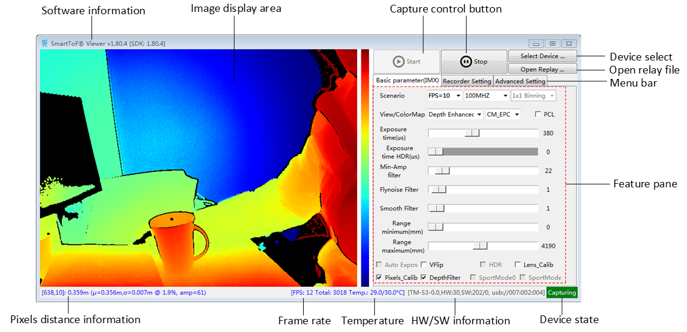
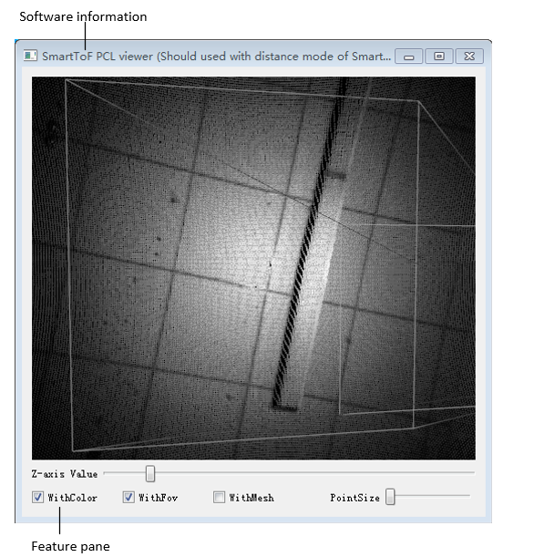
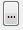
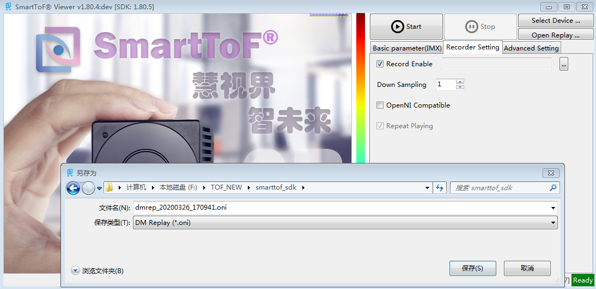
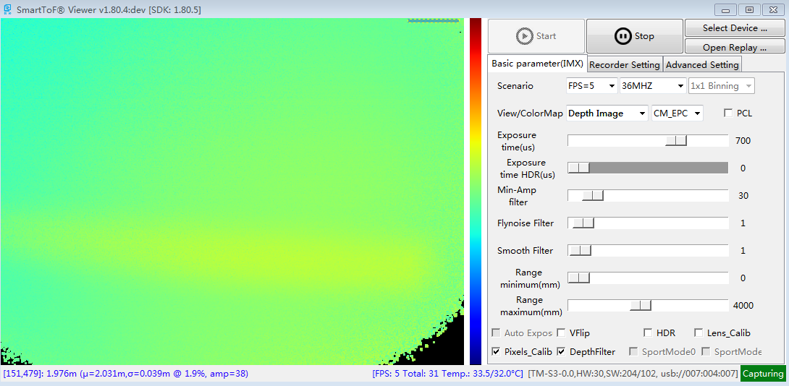
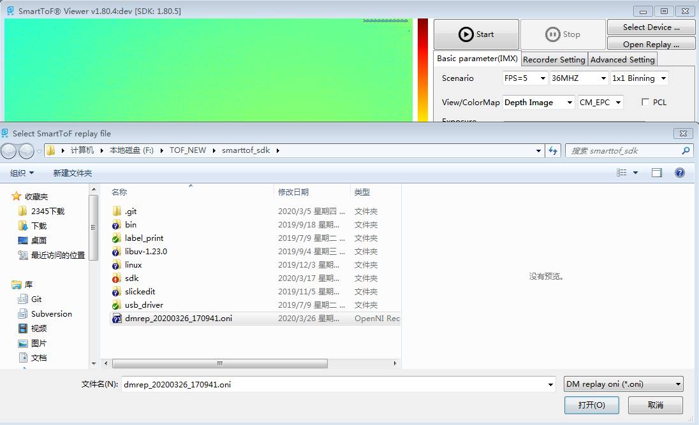

.. _doc-smarttofviewer:

SmartToFViewer Instructions
+++++++++++++++++++++++++++

Overview
=======================

| SmartToFViewer is a visualization tool that can be used to quickly evaluate the effects of the module, familiarize the effects of different parameters on the display effect, and determine the best parameters to assist the actual development and use.
| The main support functions are as follows:

 * Device selection, on, off, etc.
 * Display depth map, grayscale map, etc.
 * Display pointcloud map with PCLViewer
 * View the distance between the object and the module camera
 * View module information and working status
 * Set common parameters
 * Set filtering characteristics
 * Set sport mode
 * Video and playback video
 
Graphical interface introduction
================================

The overall preview after SmartToFViewer is opened is as follows，
SmartToFViewer interface mainly includes:

  - Capture control area
  - Image display area
  - Basic setting area
  - Advaced setting area
  - Video setting area
  - Information area
  

Detailed instructions
============================

+-------------------------------+------------------------------------------------------------------------------------------+
| Name                          | Function description                                                                     |
+===============================+==========================================================================================+
| “Start &Stop” button          | Start and stop acquire image                                                             |
+-------------------------------+------------------------------------------------------------------------------------------+
| Select Device                 | List all device and choose one to use                                                    |
+-------------------------------+------------------------------------------------------------------------------------------+
| Open Replay                   | Choose record file to replay                                                             |
+-------------------------------+------------------------------------------------------------------------------------------+
| Device state                  | Indicate camera state, including Ready, Busy, Open failed, Capturing state               |
+-------------------------------+------------------------------------------------------------------------------------------+
| HW/SW information             | Indicate camera hardware and software version, production series                         |
+-------------------------------+------------------------------------------------------------------------------------------+
| Temperature                   | Camera internal temperature                                                              |
+-------------------------------+------------------------------------------------------------------------------------------+
| Frame rate                    | Current frame rate and total frame count                                                 |
+-------------------------------+------------------------------------------------------------------------------------------+
| Pixels distance information   | [pixel axis, distance, average distance, std. error @percent, pixel amplitude]           |
+-------------------------------+------------------------------------------------------------------------------------------+
| Image display area            | Display enhanced depth map, gray map, and color depth map                                |
+-------------------------------+------------------------------------------------------------------------------------------+
| Menu bar                      | see the following chapter                                                                |
+-------------------------------+------------------------------------------------------------------------------------------+
| Scenario                      | Frame rate, modulation frequency, binning setting. Details see list after click ComBox   |
+-------------------------------+------------------------------------------------------------------------------------------+
| View/Color Map                | List all supported map and color mode                                                    |
+-------------------------------+------------------------------------------------------------------------------------------+
| PCL                           | Selected will active PCL Viewer window                                                   |
+-------------------------------+------------------------------------------------------------------------------------------+
| Exposure time                 | First exposure time(TC-E 0~1500us, TC-S 0~1000us), can be adjust during capture          |
+-------------------------------+------------------------------------------------------------------------------------------+
| HDR exposure time             | Second exposure time(TC-E 0~1500us, TC-S 0~1000us) in HDR mode, can be adjust during     |
|                               | capture, should bigger than the first exposure time                                      |
+-------------------------------+------------------------------------------------------------------------------------------+
| Min-Amp filter                | Adjust confidence threshold value via scroll bar                                         |
+-------------------------------+------------------------------------------------------------------------------------------+
| Flying noise Filter           | Adjust filter parameter via scroll bar                                                   |
+-------------------------------+------------------------------------------------------------------------------------------+
| Smooth Filter                 | Adjust filter parameter via scroll bar                                                   |
+-------------------------------+------------------------------------------------------------------------------------------+
| Range minimum                 | The depth map minimum range                                                              |
+-------------------------------+------------------------------------------------------------------------------------------+
| Range maximum                 | The depth map maximum range                                                              |
+-------------------------------+------------------------------------------------------------------------------------------+
| Auto Exposure                 | Enable/Disable auto exposure                                                             |
+-------------------------------+------------------------------------------------------------------------------------------+
| VFlip                         | Image flip setting                                                                       |
+-------------------------------+------------------------------------------------------------------------------------------+
| HDR                           | Enable/Disable HDR mode                                                                  |
+-------------------------------+------------------------------------------------------------------------------------------+
| Lens\_calib                   | Enable/Disable Lens distortion calibration                                               |
+-------------------------------+------------------------------------------------------------------------------------------+
| Pixels\_Clib                  | Enable/Disable pixels calibration                                                        |
+-------------------------------+------------------------------------------------------------------------------------------+
| DepthFilter                   | Enable/Disable depth image filter                                                        |
+-------------------------------+------------------------------------------------------------------------------------------+
| SportMode0/1                  | Enable/Disable motion blur eliminate mode （Only support TC-E series module）            |
+-------------------------------+------------------------------------------------------------------------------------------+

Recording and setting
---------------------

+---------------------+-------------------------------------------------------------+
| Name                | Function description                                        |
+=====================+=============================================================+
| Record Enable       | Enable Recording                                            |
+---------------------+-------------------------------------------------------------+
| OpenNI compatible   | Enable record file compatible OpenNI recorder format        |
+---------------------+-------------------------------------------------------------+
| Repeat Playing      | Display enhanced depth map, gray map, and color depth map   |
+---------------------+-------------------------------------------------------------+
| |1585212976162|     | Save path setting                                           |
+---------------------+-------------------------------------------------------------+

Run SmartTofViewer, switch to the "Recorder Setting" menu, check "Record Enable", and pop up the save file name and directory dialog box to save the video file, as shown below:

Click "Start", the captured image will be saved to a local file at this time, run as shown below, click the "Stop" button to stop recording:

Play the video file, click “Open Replay”, select the file you just recorded, as shown below:

Click "Start", the effect is as shown below:

.. image:: viewerfig/rec4.png

.. caution::
    In the video file replay mode, the adjustments of the “modulation frequency”, “sport mode 0”, “sport mode 1”, “HDR”, and “exposure time” settings are invalid.

	

Advaced setting area
---------------------

+----------------------+------------------------------------------------------------+
| Name                 | Function description                                       |
+======================+============================================================+
| Fmt                  | frame format                                               |
+----------------------+------------------------------------------------------------+
| Distance offset      | overall pixels distance offset                             |
+----------------------+------------------------------------------------------------+
| illumination power   | illumination power(Only for TC-S3 HW30, SW>205, BTL>101)   |
+----------------------+------------------------------------------------------------+

