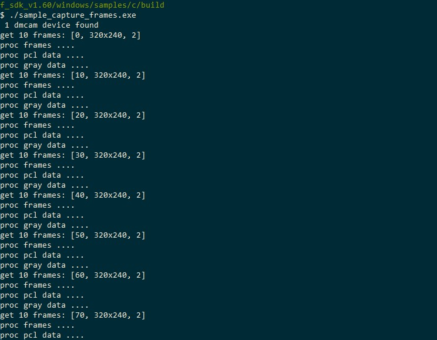

The tutorial section mainly shows the running results of each sample in different development languages ​​and other environments, and how to run each sample.

Image Acquisition
====================================

The SDK provides four basic examples: basic acquisition, parameter setting, filter enable, and saving video files.
Basically covers some interfaces commonly used in the secondary development of modules :ref:`doc-Api`,
can be used as a reference for users when developing.

Run sample_capture_frames to collect image sample program as shown in figure:

In the sample, the basic settings of the module are set before acquisition, and then the acquisition is started, and 10 frames are acquired each time, and then the depth and grayscale calculations are performed. The total number of frames is set to 100 frames, and the acquisition is stopped after the acquisition is completed.
The capture sample includes **dmcam_cap_config_set**  for configuration before collection，dmcam_cap_start，dmcam_cap_get_frames
,dmcam_frame_get_distance interfaces and so on.

