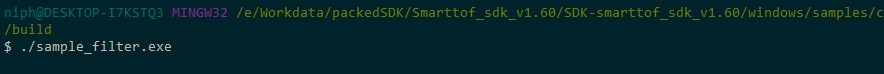

Filter
=========================

The SDK includes a variety of filtering functions such as amplitude filtering, depth filtering, automatic exposure, and motion mode for the module.
The sample_filter sample mainly shows the related enable settings and disable settings of the filter function of the module.

The program running the sample_filter sample is shown in Figure

The main API for calling the filtering function is `dmcam_filter_enable`, When setting the filter function, some need
set the parameter value, refer to :ref:`doc_param` module parameter and filter type description and code example.

