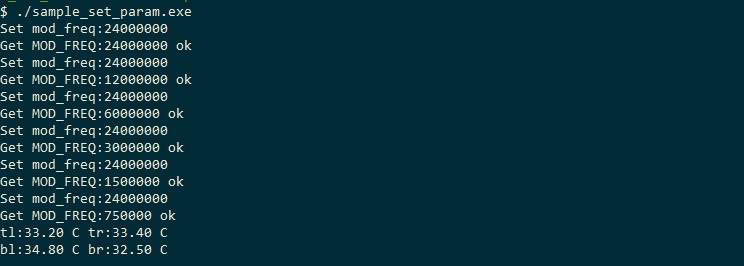

Parameter settings
==================

The **sample_set_param** example mainly shows the general method for setting module parameters.
The main parameters of the module are integration time, acquisition frame rate, modulation frequency, etc. 
The sample program results are shown in the figure:

Module parameter related interfaces include the setting and acquisition of module parameters. 
Parameter settings can be set after calling the **dmcam_dev_open** interface to open the device. 
Parameter settings are called by calling **dmcam_param_batch_set**, and parameters are obtained by calling **dmcam_param_batch_get**.

