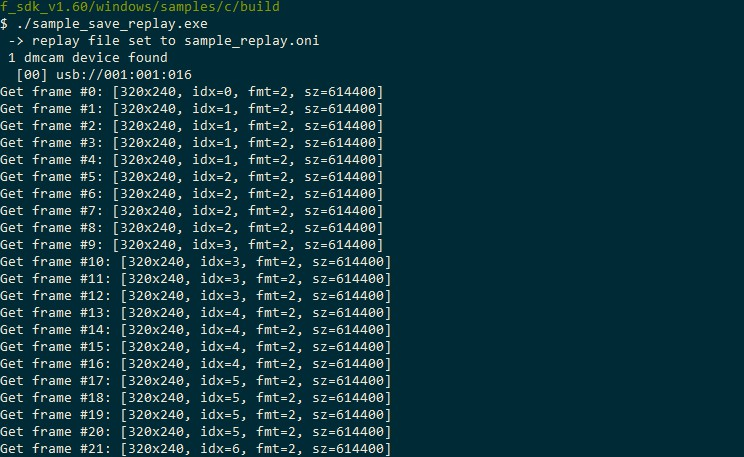

Video
===================================

The SDK provides a video recording function. You can use the saved video file to carry out previous algorithm development. 
The format of the saved video file is ONI format. When you use config to perform the settings before acquisition, specify the name of the saved video file.

run **sample_save_replay** to save the video sample program as shown in the figure:

Running the *sample_save_replay* will generate a file named sample_replay.oni，it can be played back through the *SmartToFViewer* tool. For detailed usage of the SmartToFViewer tool, please refer to :ref:`doc-smarttofviewer`.

