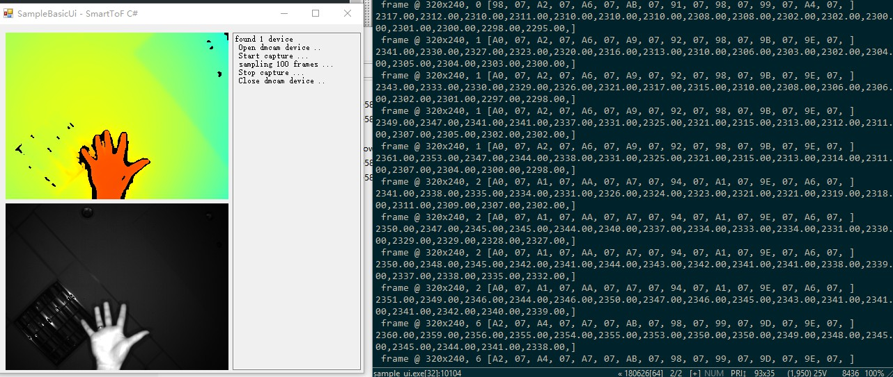

UI display
===================

*sampleBasicUi* example shows that when the acquisition interface in the SDK is called for acquisition, the image is displayed at the same time. 
The running result and the GUI interface are as shown below.

