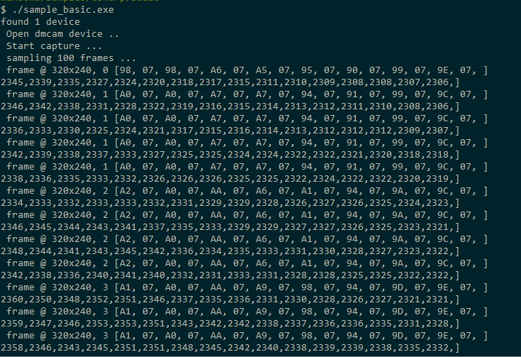

Image Acquisition
===================

The SDK provides two basic display examples, sampleBasic and sampleBasicUi, showing how to use the SDK's related interface to obtain module data in C#.

The result of running the sample_basic sample is shown below:

