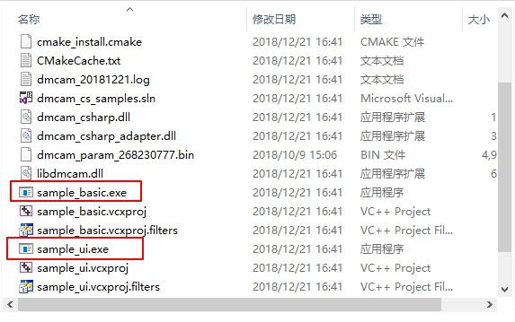

Compile and generate
=====================

Windows platform
+++++++++++++++++++

#. From the command line, go to the windows \ samples \ csharp directory and run the following command. <BUILD_TYPE> can be Release or Debug::

    mkdir build
    cd build
    cmake .. -G "Visual Studio 12 2013"		//VS version installed
    cd ..
    cmake --build ./build --config <BUILD_TYPE>
	
Generated two *sample_basic.exe* and *sample_ui.exe executable* files under the build file, as shown below:

Linux platform
+++++++++++++++++++

#. Compiling C# extensions under linux requires installing **mono** ::

    sudo apt-get install mono-complete
	
#. Go to the *linux/sample/chsarp* directory and run the following command::

    mkdir build
	cd build
	cmake .. –DCMAKE_BUILD_TYPE=Debug
	cd ..
	cmake –build build
	
Generated two sample_basic.exe and sample_ui.exe executable files under the build file, as shown below:

.. image:: imageCsharp/lin_Cs1.jpg