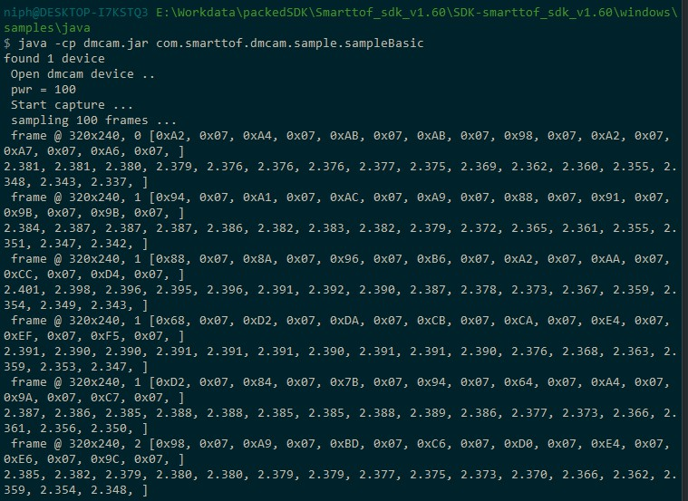

Image Acquisition
======================

The SDK provides two basic display examples, basic and basicUi, showing how to use the SDK's related interface to obtain module data in Java.

The result of running the basic sample is shown below:

