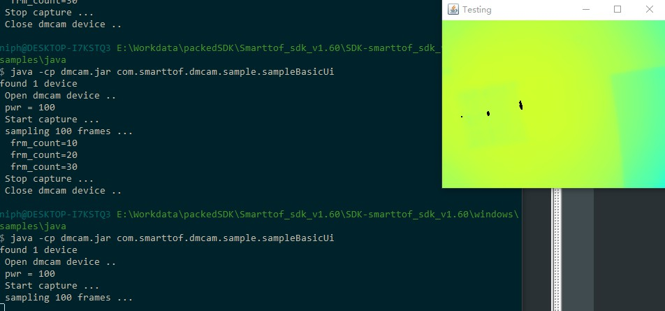

UI display
==========

Java basicUi image acquisition and display example shows that when using Java to call the acquisition interface in the SDK for acquisition, the image is displayed at the same time. 
The result of the sample operation is shown below: 

