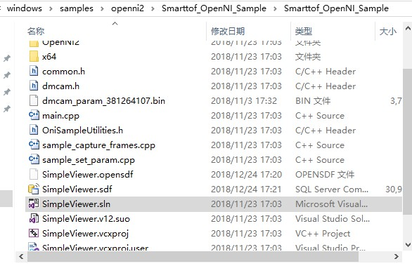
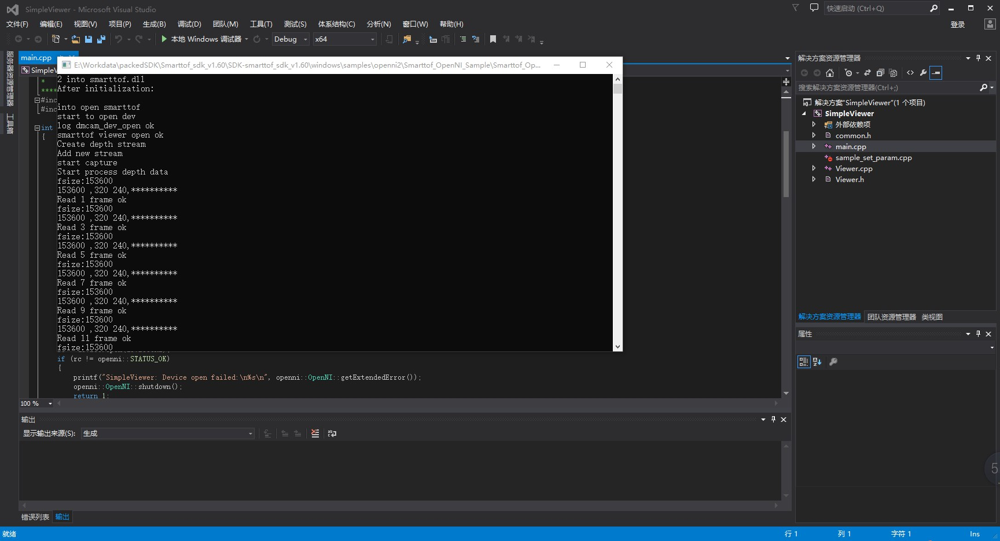

Simple capture example
==========================

SmartToF SDK also provides basic acquisition and parameter setting examples using OpenNI：

Enter Smarttof_OpenNI_Sample/Smarttof_OpenNI_Sample under the openni2 directory in the SDK, and open the VS project as shown below:

Compile and generate main.cpp, and run the result after the generation as shown below:

