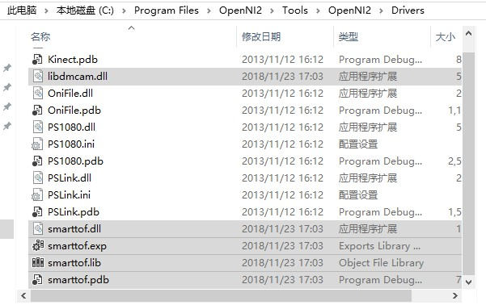
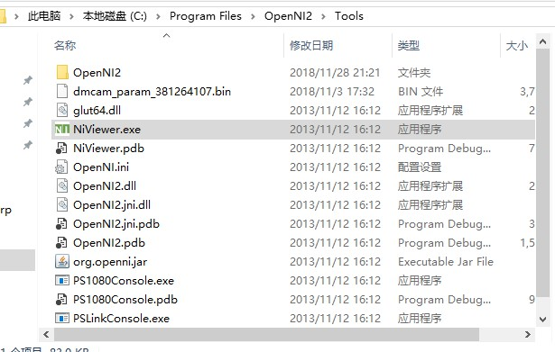
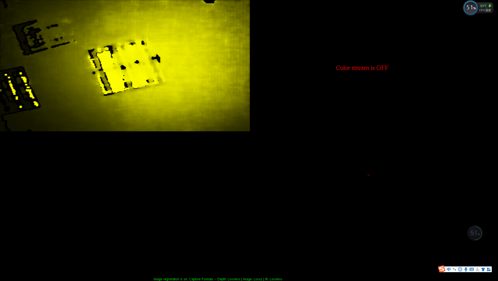

Niviewer image display
===========================

SmartToF SDK currently provides related driver libraries for Windows platforms supporting OpenNI2，
Copy libdmcam.dll、smarttof.dll、smarttof.lib、smarttof.pdb under SDK's openni2 folder to 
OpenNI2 install Tools/OpenNI2/Drivers folder，as shown below:

Go to the Tools directory, the administrator runs the NiViewer.exe program under Tools, and the results are shown below:

