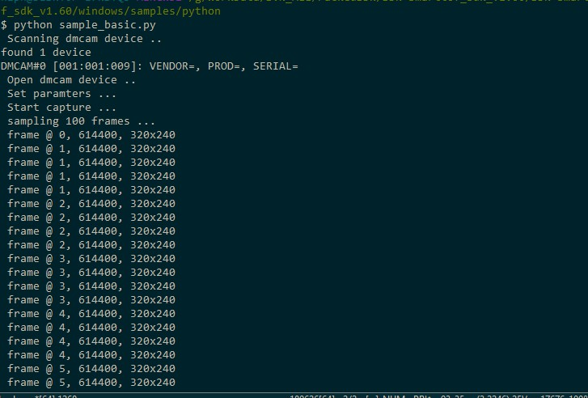

Simple capture sample
=======================

The SDK provides samples developed based on python, including basic acquisition, basic parameter settings, and
image data acquisition and display, covering some of the secondary development of modules under python :ref:`doc-Api`, can be used as
Basic reference when developing for users.

Run the *sample_basic.py* acquisition program for python::

   python sampe_basic.py

The results of running the basic acquisition program are shown below.

