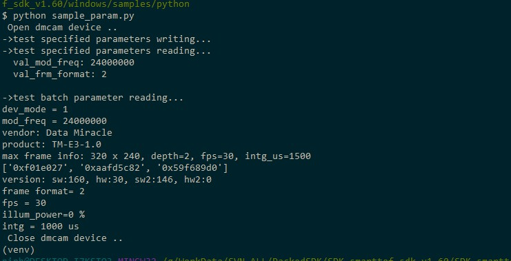

Parameter setting
=======================

The sample_param.py example mainly shows the general method for setting module parameters.
Including setting and reading of module parameters.

Run sample_param.py program::

   python sample_param.py

The result of running the parameter setting program is shown below:

