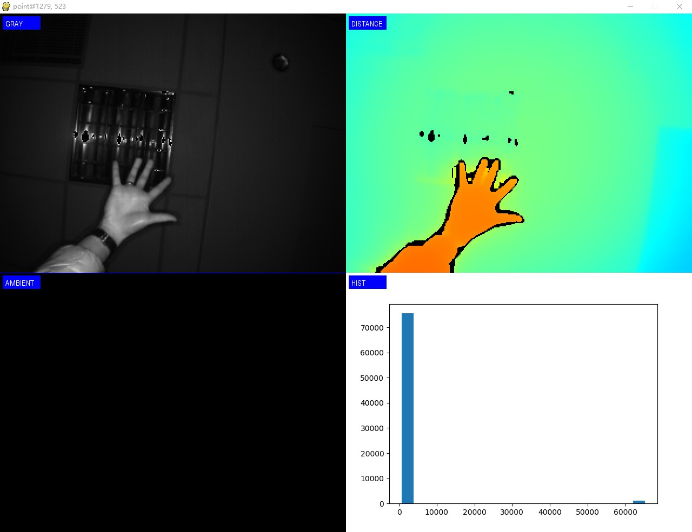

UI display
=======================

The SDK provides sample display examples of using pygame and other modules to collect images under python, such as sample_gui_pygame.py.

Run sample_gui_pygame.py::

   python sample_gui_pygame.py

The results of the program run as shown below:

