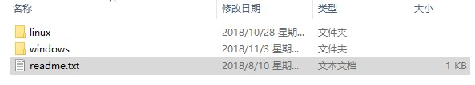
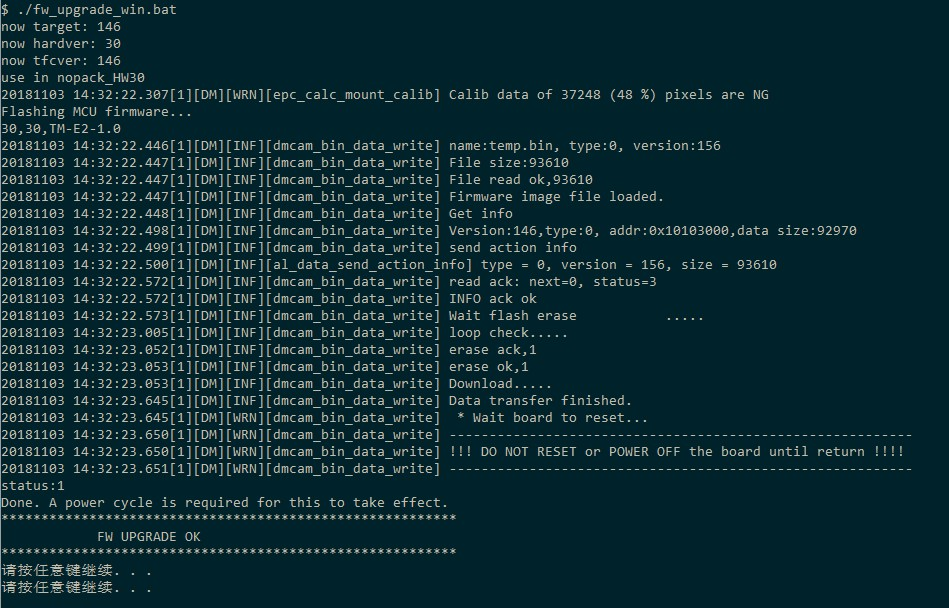
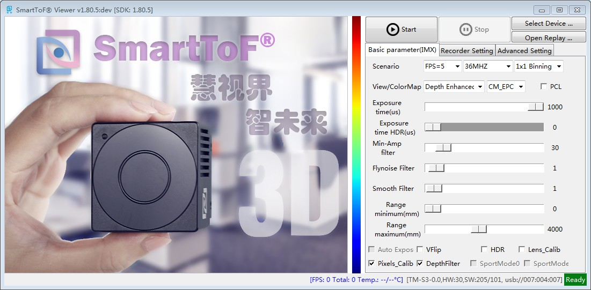
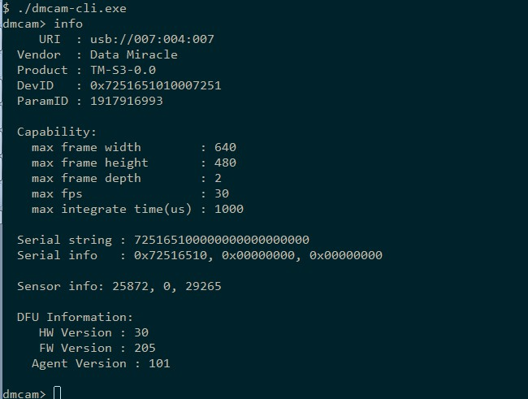

Firmware upgrade overview
=========================

Module firmware refers to the main control MCU running in the module, which mainly controls the acquisition method of the TOF chip and obtains the original data of the TOF chip. 
In order to cope with the new features of the new SDK and modify the bugs of the original version, the module firmware needs to be upgraded.

Firmware upgrade instructions
=============================

Upgrade package
---------------

Each version of the SDK includes a firmware folder, which contains two folders, windows and linux.
According to the corresponding system during the upgrade, enter the corresponding folder. The firmware folder is shown below：

Upgrade method
---------------

Enter the corresponding system upgrade package directory, such as running *fw_upgrade_win.bat* script under windows, under linux
Then run the *fw_upgrade_linux.sh* script, such as the screenshot of the upgrade under windows as shown below：

Upgrade verification
--------------------

After the upgrade, you need to confirm whether the upgrade was successful. Open the SmartToF Viewer in the SDK to check the upgraded firmware version.

In addition to SmartToF Viewer, you can also run the dmcam-cli tool, and enter interactive mode by default. Enter the **info** command and press Enter to display the module information. Check whether the version number after the MCU Firmware Version is the firmware that needs to be upgraded. Version number, as shown below：

Others
-----------------

Upgrade Document Revision History
---------------------------------

.. list-table:: Table1 Firmware Upgrade Document Revision History
	:widths: 30 40 60
	:header-rows: 1
	
	* - Version
	  - Date
	  - description
	* - 0.1
	  - 3/15/2018
	  - First edition
	* - 1.0
	  - 11/3/2018
	  - Take the firmware upgrade package as an illustration
